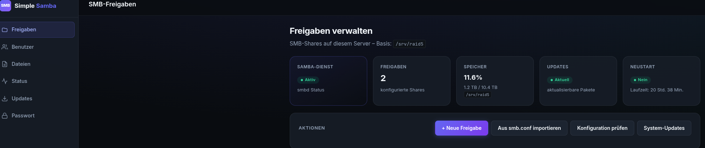
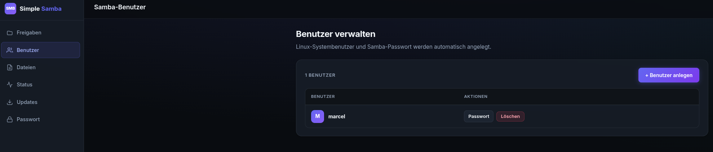
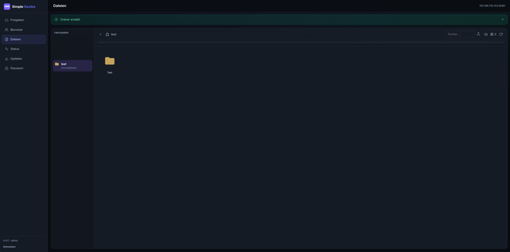
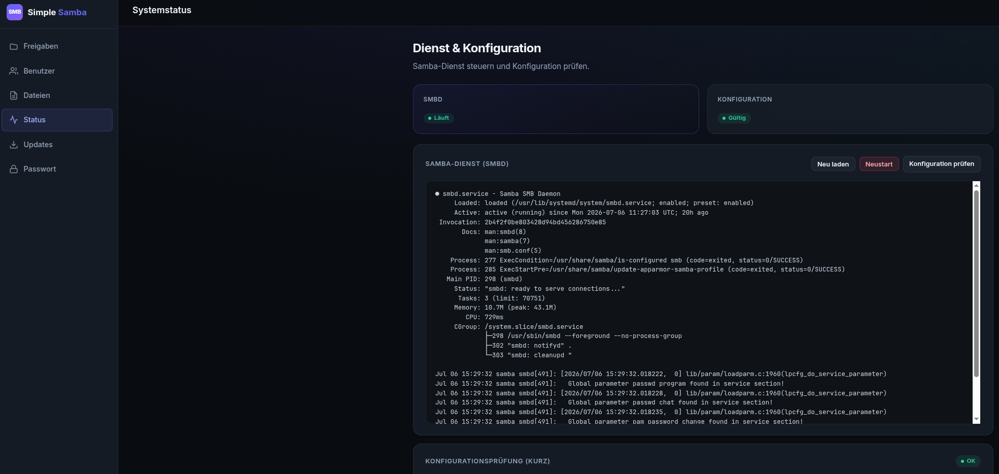
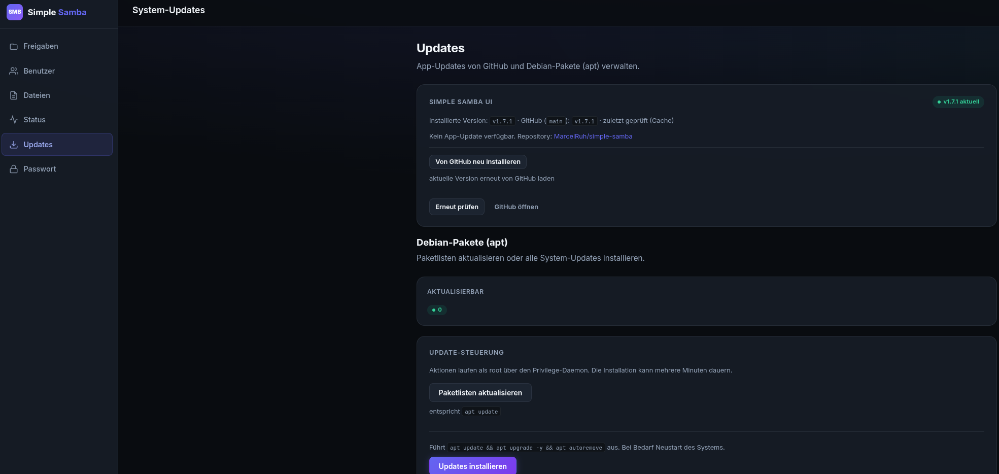
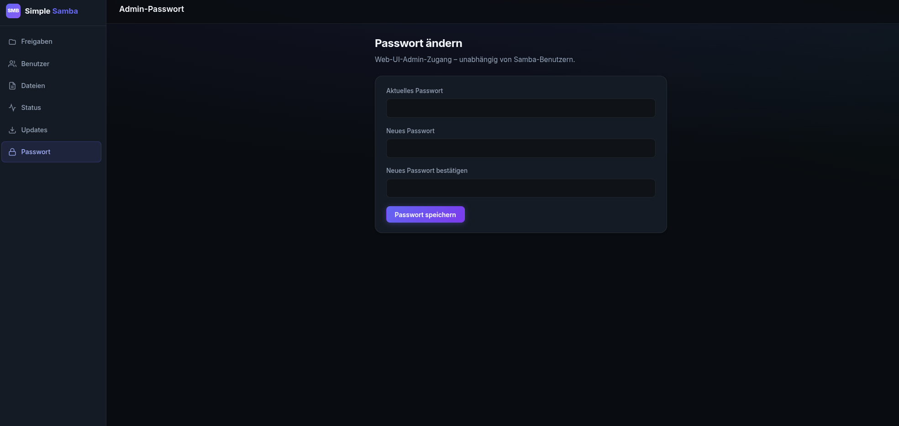

# Simple Samba UI

Interne Web-Verwaltung für Samba-Freigaben auf Debian – klein, ohne Reverse Proxy, ohne nginx/Caddy/Apache.

**Aktuelle Version:** v1.13.0

## Screenshots

| Dashboard | Benutzer |
|-----------|----------|
|  |  |

| Datei-Explorer | Status |
|----------------|--------|
|  |  |

| Updates | Admin-Passwort |
|---------|----------------|
|  |  |

## Features

- SMB-Freigaben anlegen, bearbeiten, aktivieren/deaktivieren
- Samba-Benutzer verwalten (`smbpasswd`)
- Dienststatus & Konfigurationsprüfung (`testparm`)
- System-Updates (`apt update`, `apt upgrade`, `apt autoremove`) mit Fortschrittsanzeige
- Dashboard mit Speicher, Updates und Neustart-Status
- **App-Update-Hinweis** – prüft GitHub auf neuere Versionen (Cache: 6 h)
- **App-Update-Button** – GitHub-Update direkt aus der UI
- **Datei-Explorer** – Dateien in Freigaben durchsuchen, hoch- und herunterladen (mit Fortschritt & Abbruch)
- Ordner-Download als **Streaming-ZIP** (HTTP) oder direkt in Zielordner (HTTPS)
- Downloads **direkt aus Freigaben** ohne Kopie auf die Systemplatte
- CSRF-Schutz
- Privilege-Daemon über Unix-Socket (kein sudo)

## Architektur

```
Browser (internes LAN / SSH-Tunnel)
        │
Gunicorn (User: samba-ui) – Flask-App
        │
        ├── liest /etc/samba/smb-shares.conf
        └── Unix-Socket → simple-samba-ui-priv (root)
                              ├── schreibt Freigaben + Backup
                              ├── testparm + smbd-Restart
                              └── apt-Operationen
```

## Voraussetzungen

- Debian 12/13 oder Ubuntu (mit `apt`)
- Root-Zugriff für Installation
- Samba-Datenverzeichnis (z. B. `/srv/shares`)

## Installation

### One-Liner (empfohlen)

Als **root** (wget und sudo werden bei Bedarf automatisch installiert):

```bash
wget -qO- https://raw.githubusercontent.com/MarcelRuh/simple-samba/main/bootstrap.sh | bash
```

Als normaler Benutzer mit sudo:

```bash
wget -qO- https://raw.githubusercontent.com/MarcelRuh/simple-samba/main/bootstrap.sh | sudo bash
```

Ohne sudo: zuerst `su -`, dann einen der Befehle oben als root.

Das Script klont das Repository nach `/usr/local/src/simple-samba`, installiert Abhängigkeiten, legt die App unter `/opt/simple-samba-ui` ab, erstellt Admin-Zugangsdaten und startet systemd-Dienste.

**Bestehendes Samba:** Freigaben aus `smb.conf` werden automatisch importiert. Liegen Pfade z. B. unter `/srv/raid5` statt `/srv/shares`, wird das Basisverzeichnis entsprechend erkannt und gespeichert.

Die Web-UI ist danach unter der **LAN-IP des Servers** erreichbar (Standard bei Installation: Bind auf die interne IP, z. B. `192.168.x.x:8080`).

Bei interaktiver Installation wählst du die Bind-Adresse:

1. **LAN-IP** (empfohlen) – nur im lokalen Netz erreichbar  
2. **127.0.0.1** – nur lokal / SSH-Tunnel  
3. **0.0.0.0** – alle Netzwerk-Interfaces  

Am Ende werden **URL, Benutzername und Passwort** ausgegeben.

**Optional** (eigene Werte):

```bash
SIMPLE_SAMBA_BIND_HOST=192.168.178.252 \
SIMPLE_SAMBA_BIND_PORT=8080 \
SIMPLE_SAMBA_SHARES_BASE=/srv/shares \
wget -qO- https://raw.githubusercontent.com/MarcelRuh/simple-samba/main/bootstrap.sh | bash
```

Ohne `SIMPLE_SAMBA_BIND_HOST` wird automatisch die **LAN-IP** verwendet.

### Manuell (git clone)

```bash
git clone https://github.com/MarcelRuh/simple-samba.git
cd simple-samba
sudo bash install.sh
```

### Bind-Adresse

| Adresse | Einsatz |
|---------|---------|
| LAN-IP | **Standard (Installation)** – empfohlen im lokalen Netz |
| `127.0.0.1` | Nur lokal / SSH-Tunnel |
| `0.0.0.0` | Alle Interfaces – nur in vertrauenswürdigem LAN |

Konfiguration: `/etc/simple-samba-ui/config.json`

### Installation bei bestehendem Samba

Simple Samba UI lässt sich **neben einer laufenden Samba-Installation** einrichten:

| Was passiert | Details |
|--------------|---------|
| **Daten** | Bleiben unverändert |
| **`smb.conf`** | `include = /etc/samba/smb-shares.conf` in **[global]** (nicht am Dateiende) |
| **Bestehende Freigaben** | Bleiben aktiv; optional per UI importieren |
| **Samba-Benutzer** | Werden nicht geändert |

Optional vorher sichern:

```bash
sudo cp /etc/samba/smb.conf /etc/samba/smb.conf.bak.$(date +%F)
```

Nach der Installation: **Freigaben → Aus smb.conf importieren** – übernimmt bestehende Shares in die UI-Verwaltung.

## Updates

### In der Web-UI (empfohlen)

Unter **Updates → Simple Samba UI → Von GitHub aktualisieren**. Die App lädt den Quellcode und führt `update.sh` aus.

### Manuell

Nach Änderungen am Quellcode:

```bash
cd /usr/local/src/simple-samba   # oder dein Clone-Verzeichnis
git pull
sudo bash update.sh
```

### Voraussetzung

`git` wird bei der Installation automatisch mitinstalliert (für den Update-Button).

## Deinstallation

```bash
sudo bash uninstall.sh
```

## Projektstruktur

```
simple-samba/
├── bootstrap.sh            # One-Liner-Einstieg (wget | bash)
├── install.sh / update.sh / uninstall.sh
├── app/                    # Flask-Anwendung
├── scripts/
│   ├── install-common.sh
│   └── simple-samba-ui-priv-daemon.py
└── etc/                    # systemd-Units, config.json.example
```

Nach Installation:

| Pfad | Inhalt |
|------|--------|
| `/opt/simple-samba-ui/` | App + Python-venv |
| `/etc/simple-samba-ui/config.json` | Konfiguration (chmod 600) |
| `/etc/samba/smb-shares.conf` | Verwaltete Freigaben |
| `/run/simple-samba-ui/priv.sock` | Privilege-Socket |

## Sicherheit

- Web-UI läuft **nicht als root**
- Admin-Passwort als **bcrypt-Hash**
- Kein TLS eingebaut – bei Bedarf SSH-Tunnel nutzen
- Nach Installation: Admin-Passwort ändern, `initial-password.txt` löschen
- Nicht ungefiltert ins Internet stellen
- Temporäre Upload-/Download-Dateien werden automatisch bereinigt (älter als 1 Stunde)

## Wartung

Der Privilege-Daemon räumt beim Start und stündlich verwaiste Dateien unter
`/var/lib/samba-ui/file-staging` und `/var/lib/samba-ui/download-jobs` auf.

## Lizenz

MIT – siehe [LICENSE](LICENSE).
